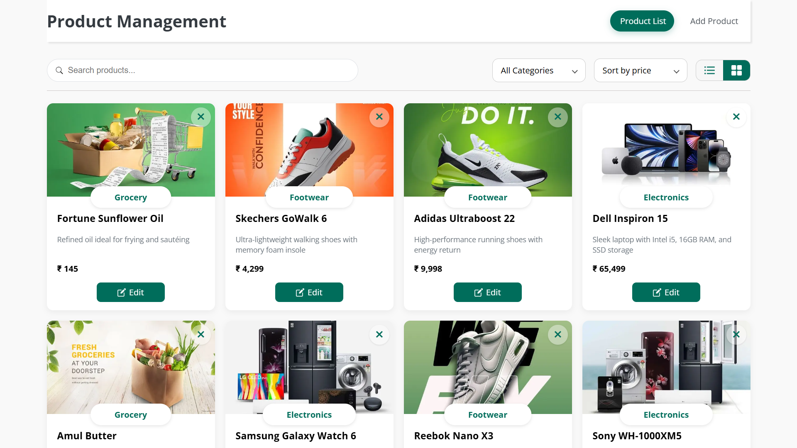
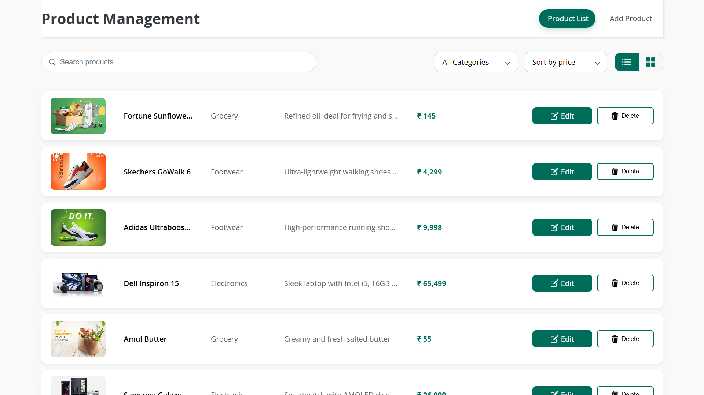
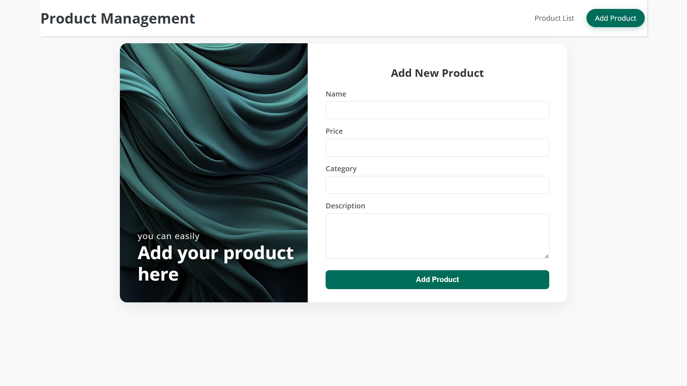
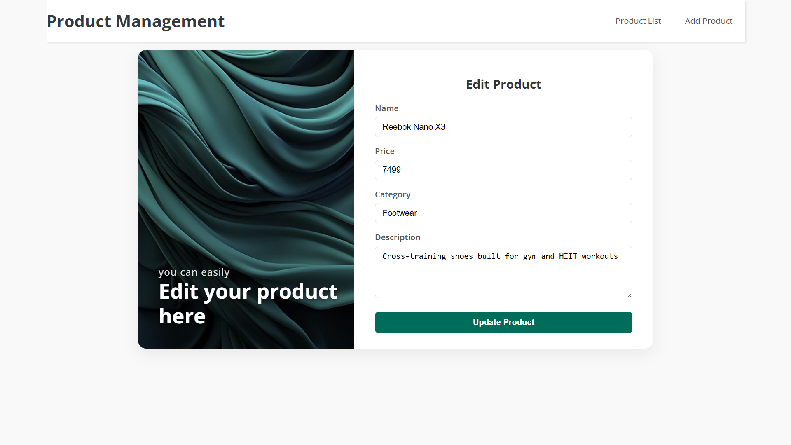
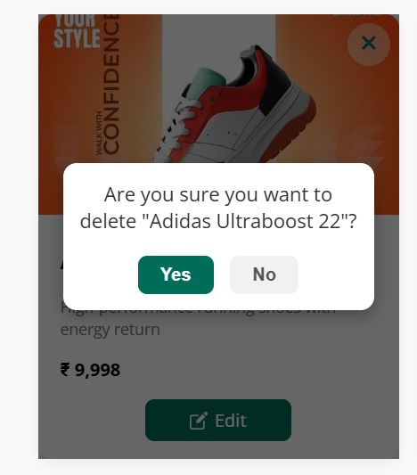
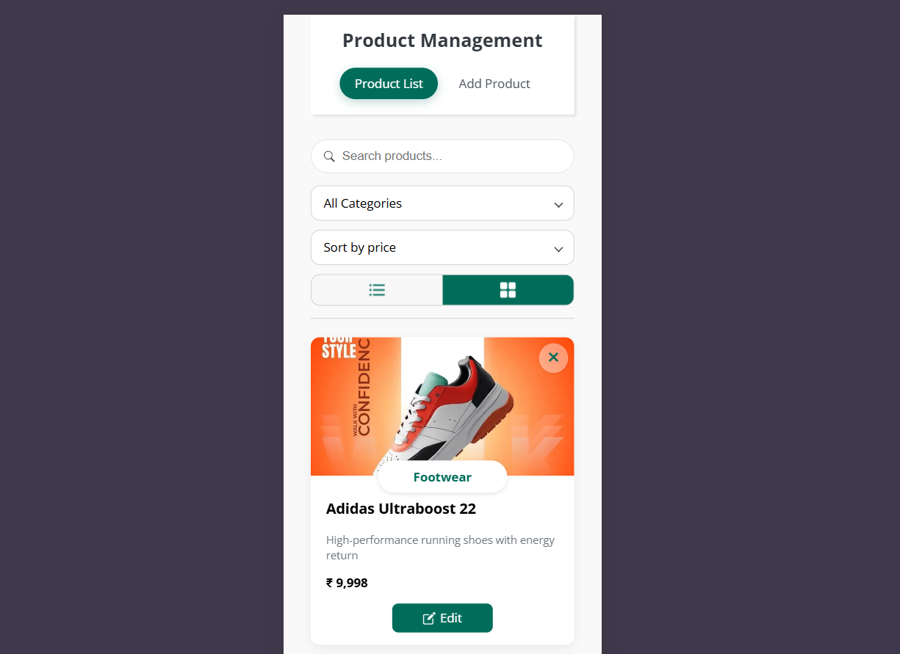
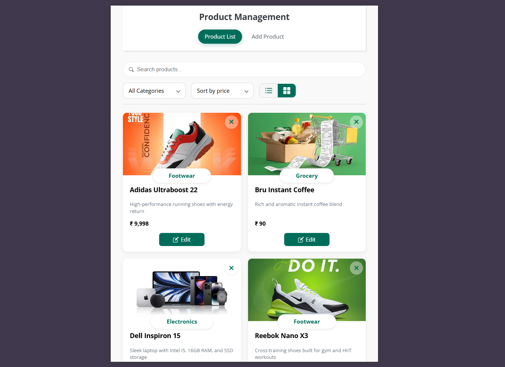
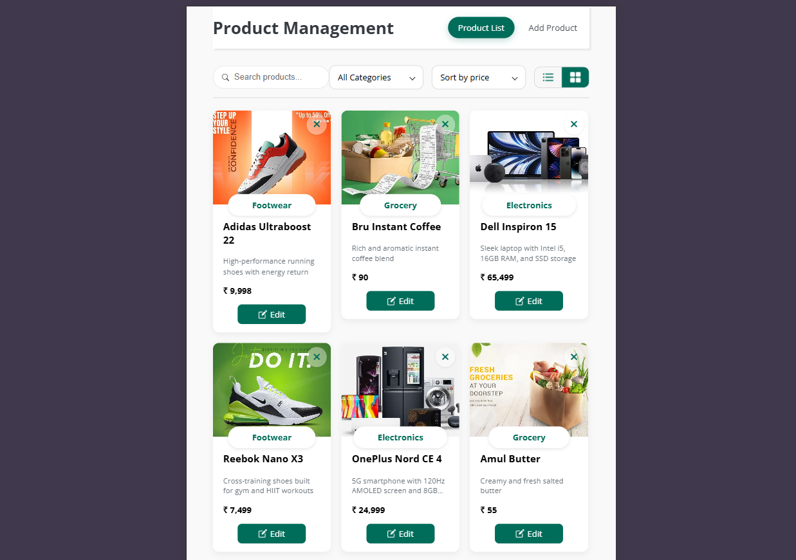

# Product Management

A modern, full-featured, and responsive web application for managing product inventory. Built with Next.js and MongoDB, this project showcases a clean UI, smooth animations, and a robust set of features for a seamless user experience.

[Live Demo](https://productm.vercel.app/)

---

## Screenshots

| Grid View                               | List View                               |
| :-------------------------------------: | :-------------------------------------: |
|  |  |

| Add Product Form                     | Edit Product Form                         |
| :---------------------------------------: | :---------------------------------------: |
|  |  |

| Delete Product Form                     |   Responsive Mobile View                       |
| :---------------------------------------: | :---------------------------------------: |
|  |  |

| iPad View                    | Surface pro View                           |
| :---------------------------------------: | :---------------------------------------: |
|  |  |


## Key Features

- **CRUD Operations**: Create, Read, Update, and Delete products.
- **Grid / List Views**: Toggle between grid and list layouts with smooth transitions.
- **Filtering & Sorting**: Live search and sorting (e.g., by price).
- **Responsive UI**: Works across desktop, tablet, and mobile.
- **Client-side Validation**: Friendly forms for add/edit with validation.
- **Safe Deletion**: Confirmation modal before deleting items.

## Tech Stack

| Category     | Technology                          |
| :----------- | :---------------------------------- |
| Framework    | Next.js (React framework)           |
| Backend      | Next.js API Routes (serverless APIs)|
| Database     | MongoDB (via Mongoose or native)    |
| Styling      | CSS (Flexbox / Grid / animations)   |
| Deploy       | Vercel / any Node-friendly host     |

## Project Structure

```

/
├── .next                # Next.js build output (do not commit)
├── components           # Reusable React components
├── lib                  # Helpers: DB connection, utils, etc.
├── node\_modules
├── pages                # Next.js pages + API routes (pages/api)
├── public               # Static assets (images, icons, screenshots)
├── styles               # Global and component CSS
├── .env.local           # Local environment variables (not committed)
├── .gitignore
├── package-lock.json
├── package.json
└── README.md

````

**Notes**
- API routes live under `pages/api` (e.g., `pages/api/products.js` → `/api/products`).
- `lib` often contains the MongoDB / Mongoose connection helper.

## Prerequisites

- Node.js v16 or later
- npm
- MongoDB (local or Atlas)

## Installation & Setup

1. **Clone the repository** (replace URL with your repository if different)
```bash
git clone https://github.com/PrasadKPV/Product_Management.git
cd productManagement
````

2. **Install dependencies**

```bash
npm install
```

3. **Create environment file**

Create a `.env.local` file in the project root:

```env
# .env.local
MONGO_URI="your_mongodb_connection_string"
# Optional: PORT if you want to override Next's default (3000)
# PORT=3000
```

> If you use MongoDB Atlas, the connection string typically looks like:
> `mongodb+srv://<username>:<password>@cluster0.mongodb.net/<dbname>?retryWrites=true&w=majority`

## Running Locally

Start the development server:

```bash
npm run dev
```

* Open `http://localhost:3000` to view the app.
* Next.js API routes run on the same server (e.g., `http://localhost:3000/api/...`).

## Production

Build and start:

```bash
npm run build
npm start
```

## Deployment

Recommended: deploy to **Vercel** (seamless with Next.js).

1. Push your repository to GitHub.
2. Import the repo in Vercel.
3. Add the `MONGO_URI` environment variable in the Vercel dashboard (Project → Settings → Environment Variables).
4. Deploy.

## Troubleshooting

* If pages don't update properly, try removing `.next` and restarting:

  ```bash
  rm -rf .next
  npm run dev
  ```
* Ensure `MONGO_URI` is correct and the DB user has network access (Atlas IP whitelist or 0.0.0.0/0 for testing).
* Confirm `package.json` contains these scripts (typical for Next.js):

  ```json
  "scripts": {
    "dev": "next dev",
    "build": "next build",
    "start": "next start"
  }
  ```
* Node version mismatch can break builds — use Node >=16.
